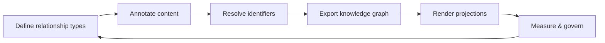

# KGS Quick Start

This folder provides a non-normative, procedural walkthrough for implementing the Knowledge Graph Schema (KGS) in a real documentation environment.

The steps describe a reference lifecycle that moves from defining semantic relationships to measuring their effectiveness. Tooling, programming languages, and platforms are intentionally left unspecified.

| Step | File                       |
|------|----------------------------|
| 1    | 01-define-relationships.md |
| 2    | 02-annotate-content.md     |
| 3    | 03-resolve-ids.md          |
| 4    | 04-export-graph.md         |
| 5    | 05-render-projections.md   |
| 6    | 06-measure-and-govern.md   |

